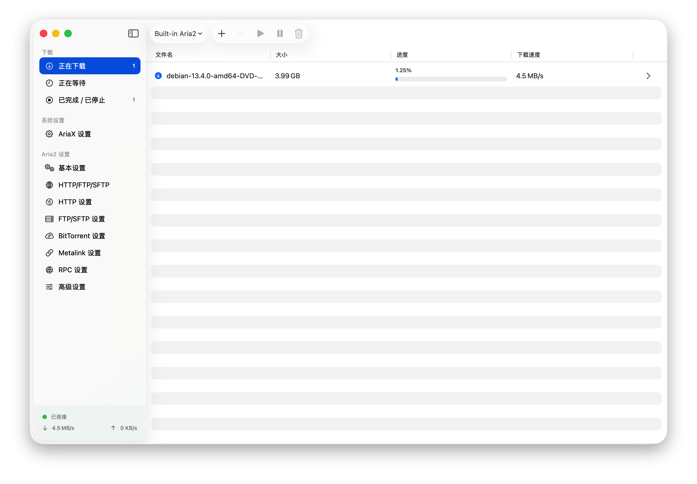
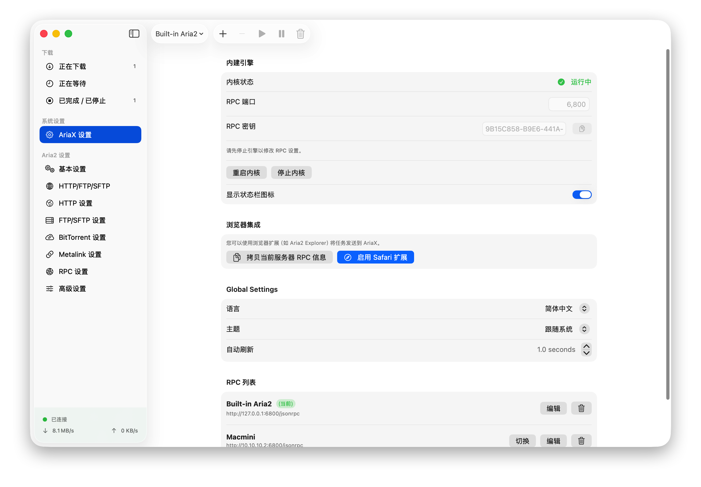

# AriaX

English | [简体中文](README_zh.md)

---

## AriaX: The Ultimate Download Manager for Apple Users

AriaX is a modern, high-performance download manager designed specifically for the Apple ecosystem (macOS & iOS). Built with **SwiftUI**, it offers a seamless, native experience that combines the industrial-strength power of `aria2` with the elegance of modern Apple design.

### Why AriaX?

*   **Native & Modern**: Fully crafted with SwiftUI for a smooth, responsive interface that feels like a part of the OS.
*   **Zero Configuration (Full Version)**: Includes a built-in, pre-configured `aria2` engine. Download and start immediately—no terminal required.
*   **Hybrid Power**: Whether you want to manage local downloads or control a remote NAS/Server via JSON-RPC, AriaX handles both with ease.
*   **Deep Integration**: 
    *   **Safari Extension**: Official extension to send tasks to AriaX with one click.
    *   **Smart URL Scheme**: Integrate with third-party apps using `ariax://`.
*   **Globalized**: Fully localized in 10+ languages including English, Simplified/Traditional Chinese, Japanese, German, and French.
*   **Dual Versions**: 
    *   **AriaX (Full)**: Includes the built-in engine, distributed via DMG.
    *   **AriaX Lite**: A lightweight remote controller available on the Mac App Store.

### Installation

1.  **AriaX (Standard/Full)**: Download the latest `.dmg` from our official distribution channel. This version contains the integrated download core.
2.  **AriaX Lite**: Search for "AriaX" on the **Mac App Store**. Best for users who already have a running `aria2` service on another device.

### Browser Integration

Enable the official Safari Extension for the best experience:
1.  Open **AriaX** -> **Settings** -> **Browser Integration**.
2.  Click **Enable Safari Extension**.
3.  In Safari Settings, check the **AriaX Extension**.
4.  Right-click any link to see "Download with AriaX".

### Privacy & Security

AriaX is designed with privacy in mind. We do not collect your download history or server credentials. All data is stored locally on your device or within your private iCloud container if syncing is enabled.

### License & Credits

- **Aria2Helper**: This component is open-source and licensed under the [GNU GPLv2](Aria2Helper/LICENSE).
- **aria2**: The core engine [aria2](https://github.com/aria2/aria2) is licensed under GNU GPLv2.
- **AriaNg**: The web interface is based on [AriaNg](https://github.com/mayswind/AriaNg), which is licensed under the MIT License.

---

© 2026 AriaX. All rights reserved.
